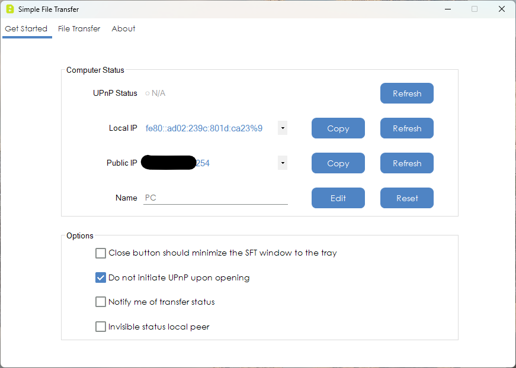
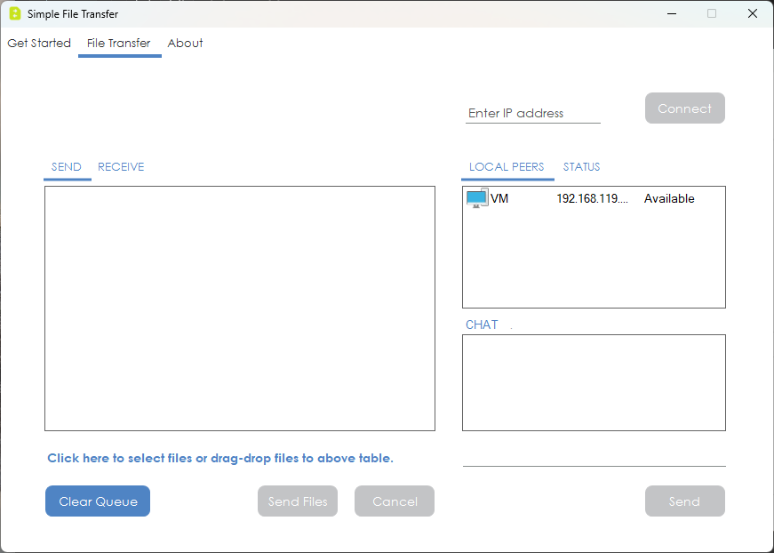
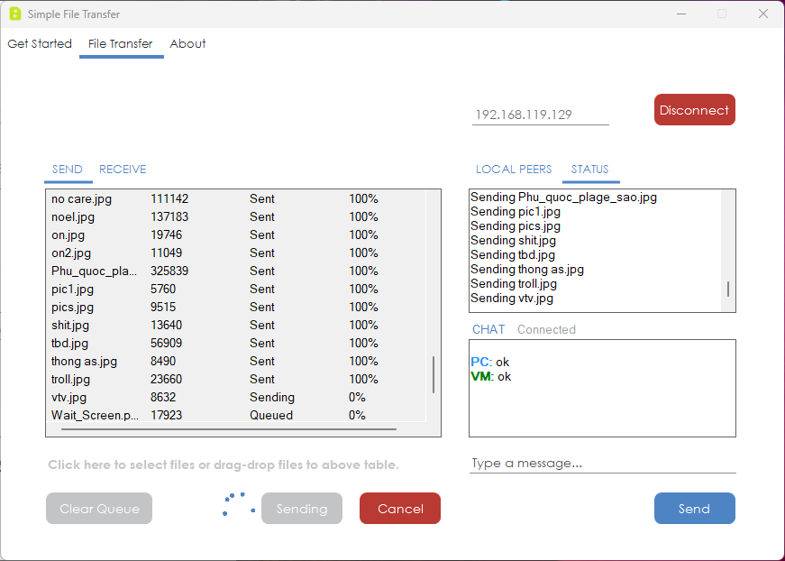
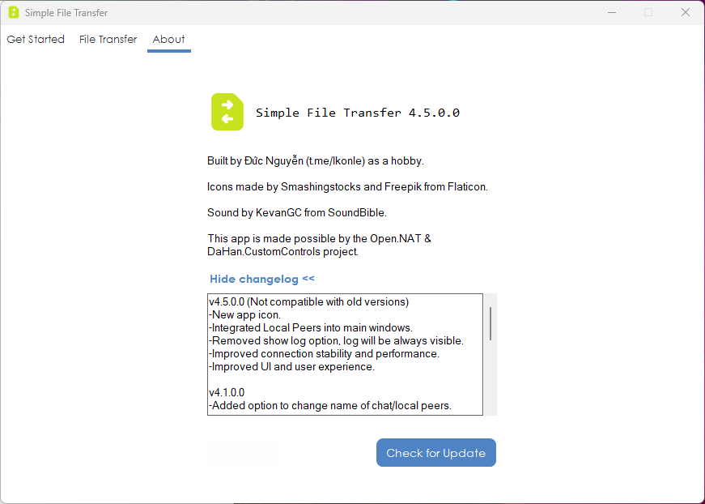

## What is this?
This small application can send and receive files between Windows computers in a network.
If you have knowledge about networking or your network has IPv6, you can even transfer over the internet (instructions below).

## Screenshots

  
  
  
  

## Improtant Note
This app has not been signed so you will/may encounter warning pop-up from Windows.

## Platform
For Windows only, no plan for other platforms
- Windows 7
- Windows 8/8.1
- Windows 10
- Windows 11

## Features
- Send and receive multiple files.
- Send and receive simultaneously.
- Unlimited file size.
- Support both IPv4 and IPv6.
- Support UPnP protocol.
- Integrated Chat.
- Local Peers.

## Privacy policy
- This product does not collect, save, transmit key strokes when user types in.
- This product does not access, collect, or transmit personal information (data that could be used to identify a person).
- This product does not share or transmit the data that user created by using this product.

## Internet transfer
Our suggestion for transfering files over the internet (if you don't have IPv6):
- Download and install free Radmin VPN at https://www.radmin-vpn.com
- Join/create your own network, share with friends.
- You can send/receive files now, using IP address from VPN.

## Contact
If you have any question, send me an email to lkonle@proton.me

